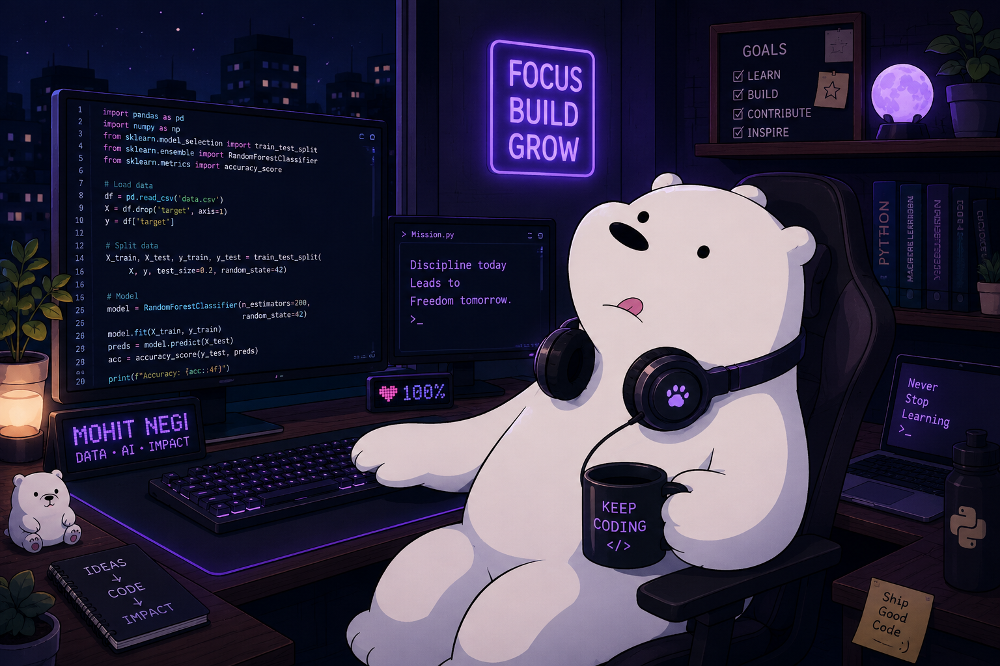

  

  

---

  

## About Me

vanshika = {
    "focus"      : ["AI Agents", "LLMs", "RAG Systems", "Data Analytics"],
    "building"   : ["Full-Stack Apps", "Automation Workflows", "Real-Time Systems"],
    "passionate" : ["AI-powered products", "Scalable systems", "Open Source"],
    "goal"       : "Combining data engineering with intelligent product development"
}
